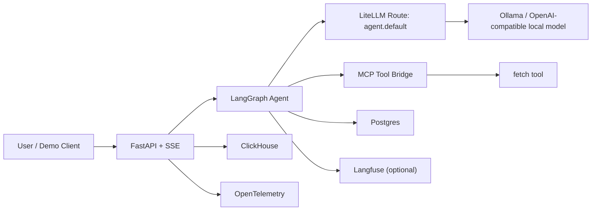
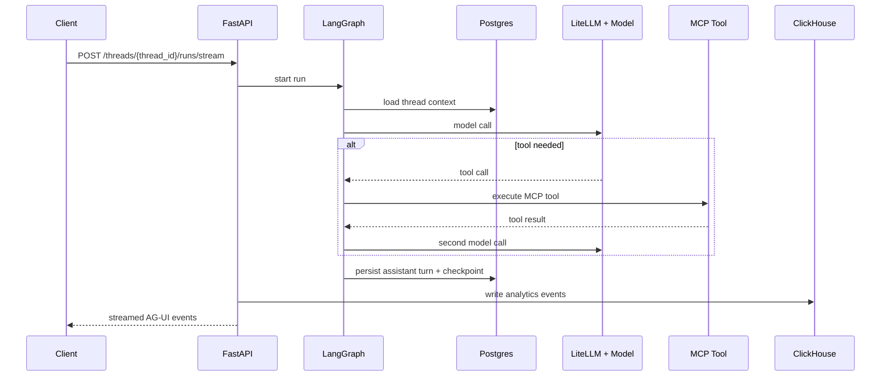
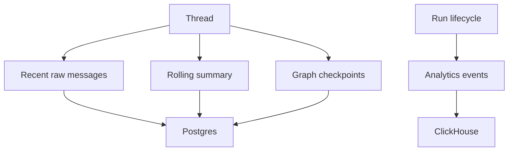

# Petrichor Agent

Petrichor Agent is a minimal local-first agent harness for engineers who want a small, inspectable reference stack instead of a large agent platform.

It runs a single conversational agent on top of a local OpenAI-compatible model endpoint, keeps thread memory in Postgres, writes immutable analytics to ClickHouse, streams AG-UI events over SSE, and emits traces through OpenTelemetry with optional Langfuse integration.

## Why This Exists

Most agent demos hide the interesting parts behind a polished UI or a managed backend. This project does the opposite.

It is meant to show, very plainly:

- how an agent loop is orchestrated
- where memory actually lives
- how tool calls are bridged into the runtime
- how traces and product analytics can stay separate
- how to keep the whole system local and debuggable

## The Shape Of The System

## What It Demonstrates

- `LangGraph` as the orchestration layer for a compact single-agent workflow
- `LiteLLM` as the provider abstraction in front of a local model
- `MCP` as the tool boundary, currently used for simple web fetching
- `Postgres` for durable thread history, rolling summary, and checkpoints
- `ClickHouse` for append-only run analytics
- `OpenTelemetry` for service-level tracing
- `Langfuse` for AI-oriented trace inspection
- `AG-UI` event semantics over plain SSE

## Positive Points

- local-first and easy to inspect
- small enough to understand quickly
- clear separation between memory, analytics, and tracing
- explicit orchestration instead of hidden agent behavior
- tool use is runtime-controlled, not just prompt-described
- easy to swap model endpoints behind one logical route
- simple enough to debug end-to-end on a laptop

## End-To-End Flow

## Agent Graph

The runtime is intentionally narrow. There is one core graph, and it roughly does this:

1. Load thread context from Postgres.
2. Build prompt messages from system prompt, rolling summary, and recent turns.
3. Call the model through LiteLLM.
4. If the model requests a tool, execute it through the MCP bridge and loop.
5. Persist the final assistant turn and checkpoint.
6. Emit analytics and traces around the whole path.

That graph lives around [app/agent/graph.py](/Users/sungjae/Documents/petrichor-agent/app/agent/graph.py), with prompt builders under [app/prompts](/Users/sungjae/Documents/petrichor-agent/app/prompts).

## Memory Model

This project deliberately avoids pretending that every form of memory is the same.

- `Postgres` holds conversational state.
- `ClickHouse` holds immutable operational/product records.
- `OpenTelemetry` and `Langfuse` hold observability data, not business memory.

That separation is one of the main design choices in the repo.

## Tooling Story

The tool boundary is model-facing but runtime-controlled.

- Tools are discovered from `.mcp.json`.
- The current example server is the official MCP `fetch` server.
- The agent exposes MCP tools to the model as OpenAI-style function schemas.
- Tool execution stays inside the app runtime rather than inside prompt-only conventions.

This keeps the tool layer replaceable without changing the rest of the graph.

## Observability Story

There are two distinct observability tracks in this project:

- `OpenTelemetry` for service and runtime tracing
- `Langfuse` for agent and model-centric trace inspection

This split is intentional. It makes it easier to answer both:

- "Why was this HTTP or DB path slow?"
- "Why did the model/tool loop behave that way?"

## What Is Intentionally Out Of Scope

This is not trying to be a complete agent platform.

- no multi-agent framework
- no auth or tenancy
- no vector store or semantic memory
- no workflow builder UI
- no production deployment story
- no large tool catalog

The value here is in being small enough to read in one sitting.

## If You’re Looking At This At World’s Fair

The interesting question is not "can it chat?"

The interesting questions are:

- Where does state live after the request ends?
- How does the model get access to tools?
- What is traced at the service layer vs the AI layer?
- What data becomes analytics vs memory?
- How much agent infrastructure can you keep local before you need a platform?

Petrichor Agent is one concrete answer to those questions.

## Repo Landmarks

- [app/main.py](/Users/sungjae/Documents/petrichor-agent/app/main.py): FastAPI surface and SSE endpoint
- [app/runtime.py](/Users/sungjae/Documents/petrichor-agent/app/runtime.py): app wiring
- [app/agent/graph.py](/Users/sungjae/Documents/petrichor-agent/app/agent/graph.py): orchestration loop
- [app/services/model.py](/Users/sungjae/Documents/petrichor-agent/app/services/model.py): LiteLLM-backed model client
- [app/services/mcp.py](/Users/sungjae/Documents/petrichor-agent/app/services/mcp.py): MCP tool registry and execution
- [app/db/postgres.py](/Users/sungjae/Documents/petrichor-agent/app/db/postgres.py): thread memory store
- [app/db/clickhouse.py](/Users/sungjae/Documents/petrichor-agent/app/db/clickhouse.py): analytics sink
- [app/observability.py](/Users/sungjae/Documents/petrichor-agent/app/observability.py): OpenTelemetry setup

## Status

The current version is intentionally minimal but working:

- single-agent chat loop
- local model via Ollama-compatible OpenAI endpoint
- MCP-backed web fetch tool
- durable thread memory
- structured run analytics
- trace instrumentation
- tiny demo client for end-to-end inspection
